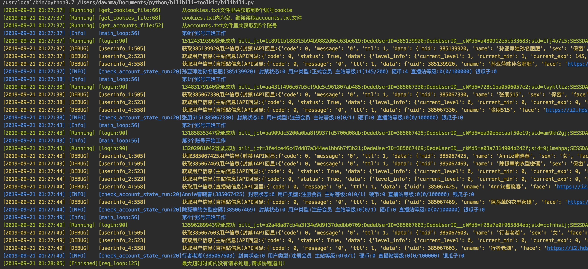

<h1 align="center">bilibili-toolkit</h1>

<p align="center">


</p>

<h4 align="center">⭐哔哩哔哩（B站）辅助工具箱，根据群内需求列表所写的多用户工具集合⭐</h4>
<h4 align="center">⭐README是抄的Hsury大佬的2333⭐</h4>

<p align="center">

</p>

## 功能

|组件                |版本           |描述                          |
|--------------------|---------------|------------------------------|
|login               |2019/9/21      |登录                           |
|check_account_state |2019/9/21      |获取用户信息                    |
|clean_dynamic       |2019/9/21      |清空动态列表                    |
|clean_not_follow_fan|2019/9/21      |清空没有回粉的粉丝               |
|clean_not_follow_up |2019/9/21      |清空没有关注自己的up             |
|coin_to_medal       |2019/9/21      |硬币兑换勋章                    |
|combo               |2019/9/21      |一键五连                       |
|comment_hate        |2019/9/21      |给评论点踩                      |
|comment_like        |2019/9/21      |给评论点赞                      |
|destory_account     |2019/11/15     |一键清空账号资产                 |
|draw_lottery        |2019/9/21      |实物抽奖                        |
|follow              |2019/9/21      |关注                           |
|level_task          |2019/9/21      |主站升级三连任务                 |
|make_fake_info      |2019/9/21      |伪造信息                        |
|query_live_reward   |2019/9/21      |查询直播站实物中奖列表            |
|query_system_notice |2019/9/21      |查询最新一条的系统通知            |
|send_danmu          |2019/9/21      |直播间发送弹幕                   |
|set_private         |2019/9/21      |设置账号隐私                    |
|sliver_to_coin      |2019/9/21      |银瓜子兑换硬币                   |
|wear_medal          |2019/9/21      |佩戴勋章                        |
|act_id_lottery      |2019/11/15     |根据act_id进行活动抽奖           |
|comment_send        |2019/11/15     |评论发送                        |
|comment_reply       |2019/11/15     |给评论回复                      |

## 使用指南

### 源代码版本（推荐）

1. 克隆或[下载](https://github.com/Dawnnnnnn/bilibili-toolkit/archive/master.zip)本代码仓库，并修改默认配置文件config.toml，添加账号(accounts.txt)或cookie(cookies.txt)，导入示例见文件内内容，以换行符分割

```
git clone https://github.com/Dawnnnnnn/bilibili-toolkit.git
cd bilibili-toolkit
vim config.toml
vim accounts.txt
vim cookies.txt
```

2. 安装Python 3.6/3.7，并使用pip安装依赖

```
pip3 install -r requirements.txt -i https://pypi.tuna.tsinghua.edu.cn/simple/ 
```

3. 启动脚本

```
python3 bilibili.py
```


### 二进制版本

还没打包，先用源代码版本


## 图形验证码识别API

目前用的一位热心群友的服务器，我的到期了，想自己搭建也没有问题，参见 https://github.com/Dawnnnnnn/bilibili-captcha 项目可自行搭建

搭建完毕后在login.py中替换地址即可


## 设计理念

项目思路大部分来自于Hsury大佬，其中不同之处就是我写这个项目的一些原因:

* 导入账号密码的格式与我现阶段工具通用的 username----password 格式不匹配
* 分割文件，使之看起来更清晰，主要是为了各位二次修改，实现定制化需求
* 用轻便的协程代替多线程
* 增加一个请求中心控制每秒请求数量，省去找代理的麻烦
* 增加一个花里胡哨的Printer类，让界面更好看
* 增加一些我/群员常用的功能

除此之外，项目的目的是提供一个多账号请求框架，关于功能的实现都很简单，简要介绍:

* apis.py里面写需要请求的api，用async写
* functions.py里面组合api实现各项功能
* network.py是lkeme大佬之前为答题机写的请求中心，用于控制每秒请求数量，req_alive_num 参数控制每秒请求量
* login.py是久远的一个登陆模块，为了省事，直接拿来用
* printer.py是我自用的花里胡哨的输出类，一定程度上方便了debug
* utils.py里面写的是不涉及网络操作的一些模块
* config.toml 配置文件，通过enable参数控制开关,其它必要参数负责传参，若要自己写模块，这里也要加一条配置控制开关
* cookies.txt 存放大量cookie的地方，如果不想使用cookie登陆，应把其中内容清空，或重命名文件
* accounts.txt 存放大量账号的地方，如果找不到cookies.txt文件或者cookies.txt里面内容为空，则读取这个文件进行登陆


## 如何实现自己定制一个模块

* 首先需要会用F12，具体百度'Chrome F12 network抓包'
* 这时候你已经能抓到请求包了，包括url form_data headers等
* 编辑apis.py文件，随便复制粘贴一个api模块，不要忘了async关键字和写注释
* 照着改改，用抓到的 form_data 替换复制过来的data里面的内容
* 注意请求方式是get还是post，再自己改一下
* 编辑config.toml文件，继续复制粘贴，必须用的参数可写在配置文件里，一般只需要写个enable就行了
* 编辑functions.py文件，复制粘贴，函数起名为{模块名_run}，然后用await调用刚刚在apis.py中写的函数
* 编辑bilibili.py文件，复制粘贴 if config['配置文件中的模块名']['enable'] 及下面的内容 用await调用刚刚在functions.py中写的函数
* 保存，运行


## 交流

QQ群：473195880 群内只接收100人，所以大部分时间都是闭群状态，有问题可以直接提issue，或者给我发邮件(1050596704@qq.com)


## 鸣谢

本项目的灵感与使用到的部分API来自以下项目或作者：

> [Hsury/Bilibili-Toolkit](https://github.com/Hsury/Bilibili-Toolkit/)

> [Lkeme](https://github.com/lkeme)

> 部分群员

